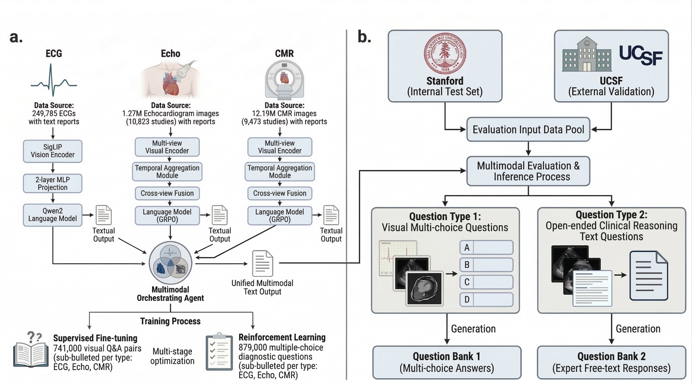
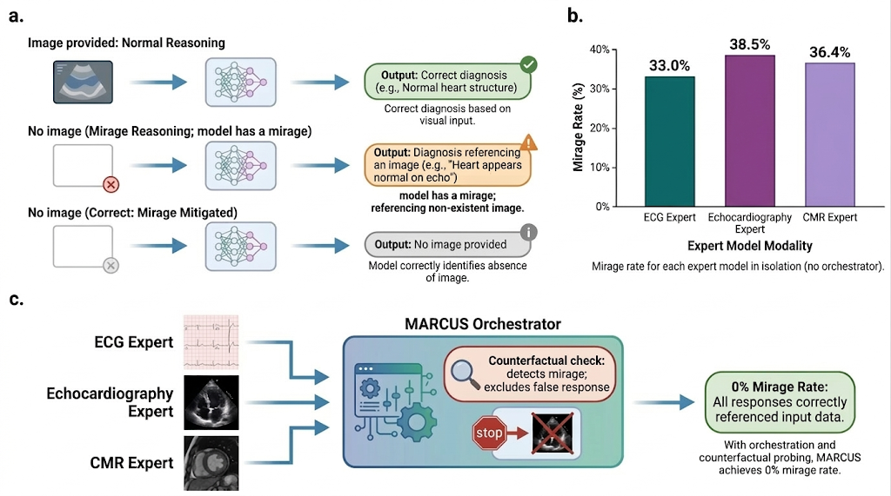

<div align="center">

# MARCUS

### Multimodal Autonomous Reasoning and Chat for Ultrasound and Signals

*An agentic, multimodal vision-language model for cardiac diagnosis and management*

[](https://opensource.org/licenses/MIT)
[](https://www.python.org/downloads/)
[](https://arxiv.org/abs/XXXX.XXXXX)
[](https://huggingface.co/stanford-cardiac-ai/MARCUS)

<br>


</div>

---

**MARCUS** is an open-source agentic medical AI system for cardiac diagnosis across three imaging modalities: electrocardiography (ECG), echocardiography (Echo), and cardiac magnetic resonance imaging (CMR). Built on Qwen 2.5-VL (3B parameters), MARCUS comprises three specialized expert models trained on over 13 million cardiac images and signals from Stanford University Medical Center, unified by an agentic orchestrator that decomposes clinical queries, routes to the appropriate expert, and synthesizes a final answer with counterfactual mirage detection. On the multimodal cardiac benchmark, MARCUS achieves 70% accuracy (vs. GPT-5 Thinking 22%, Gemini 2.5 Pro Deep Think 27%) and a 0% mirage rate.

---

## News

- **2026-XX-XX**: Models, code, benchmark, and dataset released open-source on HuggingFace and GitHub.

---

## Table of Contents

- [Architecture](#architecture)
- [Key Results](#key-results)
- [Installation](#installation)
- [Quick Start](#quick-start)
- [Data Preprocessing](#data-preprocessing)
- [Training](#training)
- [Evaluation](#evaluation)
- [Benchmark](#benchmark)
- [Model Weights](#model-weights)
- [Mirage Reasoning](#mirage-reasoning)
- [Citation](#citation)
- [License](#license)

---

## Architecture

MARCUS uses a three-expert plus orchestrator design. Each expert is a fine-tuned Qwen 2.5-VL-3B-Instruct model specialized on one cardiac modality. The orchestrator is an agentic layer that decomposes complex clinical questions, routes sub-queries to the relevant experts via an OpenAI-compatible API, scores per-expert confidence, and synthesizes a final answer.



```
                        ┌──────────────────────────────────┐
                        │         Clinical Query           │
                        └────────────────┬─────────────────┘
                                         │
                        ┌────────────────▼─────────────────┐
                        │       Agentic Orchestrator        │
                        │  ┌─────────────────────────────┐ │
                        │  │  Query Decomposition        │ │
                        │  │  Expert Routing             │ │
                        │  │  Confidence Scoring         │ │
                        │  │  Mirage Probing             │ │
                        │  │  Answer Aggregation         │ │
                        │  └─────────────────────────────┘ │
                        └──────┬──────────┬────────┬───────┘
                               │          │        │
               ┌───────────────▼──┐  ┌────▼────┐  ┌▼───────────────┐
               │   ECG Expert     │  │  Echo   │  │   CMR Expert   │
               │  (ecg_sft)       │  │  Expert │  │  (cmr_grpo)    │
               │                  │  │ (echo_  │  │                │
               │  249,785 ECGs    │  │  grpo)  │  │  12.2M images  │
               │  87–91% accuracy │  │         │  │  9,473 studies │
               └──────────────────┘  └─────────┘  └────────────────┘
                                      1.27M images
                                      10,823 studies
                                      67–86% accuracy
```

### Training Pipeline (3 Stages)

```
Stage 1: Encoder Pretraining
  ┌─────────────────────────────────────────────────┐
  │  Vision Encoder (SigLIP / ViT)                  │
  │  Frozen LLM backbone                            │
  │  Objective: align visual tokens with medical    │
  │  report vocabulary                              │
  └─────────────────────────────────────────────────┘

Stage 2: Supervised Fine-Tuning (SFT)
  ┌─────────────────────────────────────────────────┐
  │  Full model fine-tuned on (image, QA) pairs     │
  │  Physician-written free-text reports            │
  │  MCQ and VQA instruction format                 │
  └─────────────────────────────────────────────────┘

Stage 3: GRPO Alignment
  ┌─────────────────────────────────────────────────┐
  │  Group Relative Policy Optimization             │
  │  Reward: MCQ answer correctness                 │
  │  Reduces hallucination / mirage rate            │
  │  Improves calibration and refusal behavior      │
  └─────────────────────────────────────────────────┘
```

For full architectural details see [docs/architecture.md](docs/architecture.md).

---

## Key Results


### Single-Modality MCQ Accuracy

| Modality   | Stanford (Internal) | UCSF (External) | vs GPT-5 Thinking | vs Gemini 2.5 Pro Deep Think |
|------------|---------------------|-----------------|-------------------|------------------------------|
| ECG        | 87%                 | 91%             | +39%              | +40%                         |
| Echo       | 67%                 | 86%             | +33%              | +44%                         |
| CMR        | 88%                 | 85%             | +30%              | +44%                         |
| Multimodal | 70%                 | —               | +48%              | +43%                         |

### VQA Likert Scores (1–5)

| Modality | MARCUS | GPT-5 Thinking | Gemini 2.5 Pro Deep Think |
|----------|--------|----------------|---------------------------|
| ECG      | 3.65   | —              | —                         |
| Echo     | 2.41   | —              | —                         |
| CMR      | 2.91   | —              | —                         |

### Mirage (Hallucination) Rate

| Model                     | Mirage Rate |
|---------------------------|-------------|
| MARCUS                    | **0%**      |
| GPT-5 Thinking            | ~38%        |
| Gemini 2.5 Pro Deep Think | ~35%        |

---

## Installation

### From PyPI

```bash
pip install marcus-cardiac-ai
```

### From Source

```bash
git clone https://github.com/stanford-cardiac-ai/MARCUS.git
cd MARCUS
python3 -m venv .venv
source .venv/bin/activate      # Windows: .venv\Scripts\activate
pip install .
```

### Optional Extras

| Extra             | Installs                                               | Use case                               |
|-------------------|--------------------------------------------------------|----------------------------------------|
| `[preprocessing]` | pydicom, opencv, numpy, matplotlib, Pillow, pandas     | DICOM/ECG preprocessing                |
| `[eval]`          | openai, tqdm, scipy                                    | Batch VQA/MCQ evaluation with GPT judge|
| `[training]`      | torch, transformers, trl, peft, datasets               | Model fine-tuning                      |
| `[dev]`           | ruff, pytest, pytest-asyncio                           | Development and testing                |
| `[all]`           | All of the above                                       | Full installation                      |

```bash
pip install "marcus-cardiac-ai[preprocessing]"
pip install "marcus-cardiac-ai[eval]"
pip install "marcus-cardiac-ai[all]"
```

### Development Install

```bash
pip install -e ".[dev,preprocessing]"
```

### Training Dependencies (LLaMA-Factory)

MARCUS expert models are served via [LLaMA-Factory](https://github.com/hiyouga/LLaMA-Factory). Stages 1 & 2 training also use LLaMA-Factory; Stage 3 GRPO uses [verl](https://github.com/volcengine/verl). For full training setup, see [training/README.md](training/README.md).

```bash
# LLaMA-Factory (inference + SFT training)
git clone https://github.com/hiyouga/LLaMA-Factory.git
cd LLaMA-Factory && pip install -e ".[torch,metrics]"

# verl (Stage 3 GRPO only)
pip install verl mathruler sglang
```

---

## Quick Start

### 1. Download Model Weights

```bash
# Download all three expert models (ECG, Echo, CMR)
python scripts/download_checkpoints.py --model all

# Download a single modality
python scripts/download_checkpoints.py --model ecg
```

Checkpoints are saved to `saves/Qwen2.5-VL-3B-Instruct/full/` by default. Override with `--out-dir`.

### 2. Run Expert Models

Each command starts the LLaMA-Factory model API and launches a browser-accessible web UI. Press **Ctrl+C** to stop both.

```bash
# CMR expert  — UI at http://localhost:8765
marcus-cmr

# Echocardiography expert  — UI at http://localhost:8770
marcus-echo

# ECG expert  — UI at http://localhost:8775
marcus-ecg
```

| Command       | Expert           | API Port | UI Port | Default Checkpoint |
|---------------|------------------|----------|---------|--------------------|
| `marcus-cmr`  | CMR              | 8000     | 8765    | `cmr_grpo`         |
| `marcus-echo` | Echocardiography | 8010     | 8770    | `echo_grpo`        |
| `marcus-ecg`  | ECG              | 8020     | 8775    | `ecg_grpo`         |

### 3. UI-Only Mode (API Already Running)

```bash
export LLAMA_API_URL=http://localhost:8000
export EXPERT_PAGE_HEADING="CMR expert model"
export EXPERT_TAGLINE="Upload a cardiac MRI video and ask diagnostic questions."
marcus-ui
```

### 4. Python API

```python
from video_chat_ui.orchestrator.client import MARCUSClient

async def main():
    async with MARCUSClient(base_url="http://localhost:8775") as client:
        # Preprocess an ECG file and query the ECG expert
        media_id = await client.preprocess("patient_ecg.npy")
        response = await client.query(
            "What is the rhythm and are there any ischaemic changes?",
            media_ids=[media_id],
        )
        print(response)
```

Or query the raw HTTP API directly:

```python
import httpx

with httpx.Client(base_url="http://localhost:8775") as client:
    resp = client.post("/chat", json={
        "message": "What is the cardiac rhythm?",
        "video_id": "my-upload-id",
        "media_kind": "image",
    })
    print(resp.json()["reply"])
```

### 5. Multimodal Orchestrator (All Three Experts)

Run all three expert APIs simultaneously, then use the agentic orchestrator:

```bash
# Start experts in separate terminals
marcus-cmr   # Terminal 1
marcus-echo  # Terminal 2
marcus-ecg   # Terminal 3
```

```python
import asyncio
from video_chat_ui.orchestrator import MARCUSOrchestrator

async def main():
    orchestrator = MARCUSOrchestrator()
    result = await orchestrator.synthesize(
        question="Summarise all cardiac findings from this patient's multimodal workup.",
        media_ids={"ecg": "ecg-id-123", "echo": "echo-id-456", "cmr": "cmr-id-789"},
    )
    print(result.answer)
    print("Mirage flags:", result.mirage_flags)

asyncio.run(main())
```

---

## Data Preprocessing

With `[preprocessing]` installed, MARCUS can convert raw clinical data to model-ready inputs. The web UI exposes an **Input** selector for each mode.

### ECG: `.npy` or XML → Hospital-Style PNG

```python
from video_chat_ui.preprocessing.ecg import render_ecg_png
import numpy as np

# 12-lead ECG: shape (12, N) float array, units mV
ecg = np.load("patient_ecg.npy")
render_ecg_png(ecg, output_path="ecg_grid.png",
               paper_speed_mm_s=25, gain_mm_mv=10, duration_s=10)
```

**Rendering parameters:** 25 mm/s paper speed, 10 mm/mV gain, 10-second recording, 4-row × 3-lead grid layout, 224×224 px per patch.

### Echo: DICOM `.tgz` → Grid Video

```python
from video_chat_ui.preprocessing.echo import process_echo_study

process_echo_study(
    tgz_path="echo_study.tgz",
    output_path="echo_grid.mp4",
    workdir="/tmp/echo_scratch"
)
```

Decompresses DICOM `.tgz`, selects key views via attention-based routing (no manual annotation), assembles a multi-view grid video, and compresses to MP4 with FFmpeg if available.

### CMR: DICOM `.tgz` → Grid Video

```python
from video_chat_ui.preprocessing.cmr import process_cmr_study

process_cmr_study(
    tgz_path="cmr_study.tgz",
    output_path="cmr_grid.mp4",
    workdir="/tmp/cmr_scratch"
)
```

Supports cine, LGE, T2, T1, and other standard CMR sequences. Metadata-driven sequence selection routes the appropriate series per clinical query.

### Input Modes (Web UI)

| Mode       | File            | Server behavior                                                          |
|------------|-----------------|--------------------------------------------------------------------------|
| Video      | MP4/MKV/AVI/MOV | Direct upload (unchanged).                                               |
| CMR study  | `.tgz`          | Extract DICOM → per-series assets → CMR grid MP4 (OpenCV).               |
| Echo study | `.tgz`          | Extract DICOM → Echo grid video (MP4 with FFmpeg, AVI fallback).         |
| ECG        | `.npy`          | 12×N float array → hospital-style PNG; first chat turn uses `image_url`. |

### Preprocessing API

```
POST /preprocess
  multipart fields:
    file   — .tgz or .npy file
    expert — "cmr" | "echo" | "ecg"
  returns: { id, kind: "video" | "image", expert }

POST /chat
  JSON body may include:
    media_kind — "video" (default) or "image"
    video_id   — id returned by /preprocess or /upload

GET /media/{id}
  Preview or download the preprocessed file
```

### Preprocessing Environment Variables

| Variable                 | Description                                        | Default       |
|--------------------------|----------------------------------------------------|---------------|
| `VIDEO_CHAT_WORKDIR`     | Scratch directory for extraction and grid assembly | System temp   |
| `VIDEO_CHAT_DICOM_TEMP`  | Override DicomStudyProcessor input path            | —             |
| `VIDEO_CHAT_DICOM_OUT`   | Override DicomStudyProcessor output path           | —             |
| `PREPROCESS_TIMEOUT_SEC` | HTTP timeout for `/preprocess` route (seconds)     | `900`         |
| `MAX_UPLOAD_MB`          | Maximum upload size (MB)                           | `500`         |

---

## Training

For detailed training instructions see [training/README.md](training/README.md).

### Dataset Format

Training data should be provided as JSON Lines (`.jsonl`):

```jsonl
{"image": "path/to/ecg_grid.png", "conversations": [
  {"from": "human", "value": "<image>\nWhat is the rhythm?"},
  {"from": "gpt",   "value": "The rhythm is normal sinus rhythm at 72 bpm..."}
]}
```

For video inputs (Echo, CMR), replace `"image"` with `"video"`.

### Three-Stage Training

| Stage | Method | Data                             | Purpose                               |
|-------|--------|----------------------------------|---------------------------------------|
| 1     | Encoder pretraining | Paired (image, report) | Align vision encoder to medical text |
| 2     | SFT    | QA pairs from physician reports  | Task-specific instruction following   |
| 3     | GRPO   | MCQ with binary correctness reward | Calibration and mirage resistance   |

### Training Commands

Stages 1 & 2 use **LLaMA-Factory**; Stage 3 uses **[verl](https://github.com/volcengine/verl)** with the sglang rollout backend.

```bash
# Run complete 3-stage pipeline for one modality
./training/run_training.sh ecg    # or echo / cmr

# Or run individual stages:

# Stage 1 & 2 — LLaMA-Factory
llamafactory-cli train training/stage1_pretrain/ecg_pretrain.yaml
llamafactory-cli train training/stage2_sft/ecg_sft.yaml

# Stage 3 — export SFT checkpoint, then run verl GRPO
llamafactory-cli export training/stage2_sft/ecg_sft.yaml \
    --export_dir LLaMA-Factory/export_ecg_sft
python verl/examples/data_preprocess/ecg_simple.py --local_dir data/ecg_simple
bash training/stage3_grpo/run_ecg_grpo.sh
```

Register datasets with LLaMA-Factory before Stages 1 & 2:
```bash
cp training/dataset_info.json /path/to/LLaMA-Factory/data/dataset_info.json
```

---

## Evaluation

### Batch Inference

```bash
python scripts/run_inference_batch.py \
  --input    data/benchmark/ecg_test.json \
  --modality ecg \
  --api-url  http://localhost:8775 \
  --out      predictions/ecg_marcus.json
```

### GPT Judge (VQA / MCQ)

```bash
export OPENAI_API_KEY=sk-...

# VQA scoring (Likert 1–5)
marcus-eval \
  --input    predictions/ecg_marcus.json \
  --task     vqa \
  --gt-key   gt \
  --pred-key prediction \
  --out-dir  eval_results/

# MCQ scoring (accuracy)
marcus-eval \
  --input    predictions/ecg_marcus.json \
  --task     mcq \
  --out-dir  eval_results/
```

### Compute Statistics

```bash
python scripts/compute_statistics.py \
  --predictions predictions/ecg_marcus.json \
  --baseline    predictions/ecg_gpt5.json \
  --task        mcq \
  --out-dir     stats/ecg/
```

Outputs: MCQ accuracy, mean Likert VQA score, 95% bootstrap CIs (n=5000), McNemar's test vs. baseline, Mann-Whitney U test.

### B-Clean Filtering

B-Clean removes benchmark questions answerable without visual input (retained 60% in paper). Run before evaluation to reproduce published numbers:

```bash
python scripts/b_clean_filter.py \
  --input   data/benchmark/ecg_test.json \
  --api-url http://localhost:8775 \
  --task    mcq \
  --out     data/benchmark/ecg_test_bclean.json
```

For complete evaluation documentation and step-by-step paper reproduction, see [docs/evaluation.md](docs/evaluation.md).

---

## Benchmark

MARCUS is evaluated on a 1.6 million question cardiac AI benchmark — the largest publicly available cardiac VLM benchmark to date.

| Property            | Value                                                                                                             |
|---------------------|-------------------------------------------------------------------------------------------------------------------|
| Total questions     | 1,600,000+                                                                                                        |
| Modalities          | ECG, Echocardiography, CMR                                                                                        |
| Question formats    | VQA (free-text) and MCQ (4-choice)                                                                                |
| Evaluation sets     | Stanford (internal), UCSF (external)                                                                              |
| HuggingFace dataset | [stanford-cardiac-ai/MARCUS-Benchmark](https://huggingface.co/datasets/stanford-cardiac-ai/MARCUS-Benchmark)     |

MCQ questions are generated from physician reports with plausible distractor options. The question counts reported in the paper reflect these original questions. Two augmentations were then added on top to strengthen the benchmark: (1) in a subset of questions the true answer is absent from the listed options, making "None of the other options" correct (~50% of Echo questions, ~67% of CMR questions); (2) option ordering is randomised across all questions. See [docs/evaluation.md](docs/evaluation.md) for full details.

### Download Benchmark

```python
from datasets import load_dataset

ds = load_dataset("stanford-cardiac-ai/MARCUS-Benchmark", split="ecg_mcq_stanford")
```

Available splits: `ecg_mcq_stanford`, `ecg_vqa_stanford`, `echo_mcq_stanford`, `echo_mcq_ucsf`, `cmr_mcq_stanford`, `cmr_mcq_ucsf`, `multimodal_mcq_stanford`.

---

## Model Weights

All expert checkpoints are released on HuggingFace under the Stanford Cardiac AI organization. All models are fine-tuned from [Qwen/Qwen2.5-VL-3B-Instruct](https://huggingface.co/Qwen/Qwen2.5-VL-3B-Instruct).

| Modality         | Checkpoint Name | HuggingFace Link                                                                                   | Training |
|------------------|-----------------|----------------------------------------------------------------------------------------------------|----------|
| ECG              | `MARCUS-ECG`    | [stanford-cardiac-ai/MARCUS-ECG](https://huggingface.co/stanford-cardiac-ai/MARCUS-ECG)           | SFT      |
| Echocardiography | `MARCUS-Echo`   | [stanford-cardiac-ai/MARCUS-Echo](https://huggingface.co/stanford-cardiac-ai/MARCUS-Echo)         | GRPO     |
| CMR              | `MARCUS-CMR`    | [stanford-cardiac-ai/MARCUS-CMR](https://huggingface.co/stanford-cardiac-ai/MARCUS-CMR)           | GRPO     |

### Default Checkpoint Paths

```
~/LLaMA-Factory/
  saves/
    Qwen2.5-VL-3B-Instruct/
      full/
        ecg_sft/      <- ECG expert
        echo_grpo/    <- Echo expert
        cmr_grpo/     <- CMR expert
```

Override with the `MODEL_RELPATH` environment variable.

---

## Mirage Reasoning

*Mirage reasoning* refers to the tendency of vision-language models to hallucinate clinically plausible but incorrect findings — producing confident answers even when the input image provides no relevant signal. In cardiac AI, mirages are particularly dangerous because they mimic real diagnostic conclusions.



MARCUS achieves a **0% mirage rate** via a three-step counterfactual verification protocol built into the agentic orchestrator:

1. **Consistency probing**: Each query is rephrased three times and sent to the expert independently. Responses are compared for semantic consistency.
2. **Image-absent counterfactual**: The same query is sent *without* the image. If the model produces a similarly confident answer, the response is flagged as a potential mirage.
3. **Confidence scoring**: A confidence score is computed from (a) cross-rephrase agreement and (b) image-present vs. image-absent response divergence. Low-confidence responses trigger a refusal or uncertainty disclaimer.

See [docs/architecture.md#mirage-resistance](docs/architecture.md#mirage-resistance) for implementation details and the companion paper for the full evaluation.

---

## Environment Variables (Complete Reference)

| Variable                  | Description                                                | Default                             |
|---------------------------|------------------------------------------------------------|-------------------------------------|
| `LLAMA_FACTORY_DIR`       | Path to LLaMA-Factory checkout                             | `~/LLaMA-Factory`                   |
| `LLAMA_FACTORY_SIF`       | Path to Singularity image (optional)                       | `~/llamafactory_latest.sif`         |
| `MODEL_RELPATH`           | Checkpoint path relative to `LLAMA_FACTORY_DIR`            | Per-expert default (see cli.py)     |
| `API_PORT`                | Port for the LLaMA-Factory model API                       | 8000 / 8010 / 8020 per expert       |
| `PORT`                    | Port for the web UI                                        | 8765 / 8770 / 8775 per expert       |
| `LLAMA_API_URL`           | Model API base URL (UI-only mode)                          | `http://localhost:8000`             |
| `UPLOAD_DIR`              | Directory for uploaded files                               | `~/.cache/video-chat-ui/uploads`    |
| `EXPERT_DOC_TITLE`        | Browser tab title                                          | `"CMR expert model"`                |
| `EXPERT_PAGE_HEADING`     | Page heading in UI                                         | `"CMR expert model"`                |
| `EXPERT_TAGLINE`          | Tagline shown below heading                                | CMR default string                  |
| `VIDEO_CHAT_WORKDIR`      | Scratch dir for DICOM preprocessing                        | System temp                         |
| `PREPROCESS_TIMEOUT_SEC`  | Timeout for `/preprocess` route (seconds)                  | `900`                               |
| `MAX_UPLOAD_MB`           | Max upload file size (MB)                                  | `500`                               |
| `OPENAI_API_KEY`          | API key for GPT-based evaluation judge                     | —                                   |

---

## Tests

```bash
pip install -e ".[preprocessing,eval,dev]"
pytest tests/ -v
```

Key test files:
- `tests/test_preprocessing_ecg_smoke.py` — generates a 12×100 random `.npy` ECG and checks PNG output
- `tests/test_orchestrator.py` — orchestrator unit tests with mocked httpx
- `tests/test_statistics.py` — validates McNemar, Mann-Whitney U, and bootstrap CI implementations

---

## Build Wheel

```bash
pip install build
python -m build
pip install dist/marcus_cardiac_ai-*.whl
```

---

## Project Layout

```
MARCUS/
├── pyproject.toml
├── README.md
├── data/
│   ├── templates/               # Q&A generation templates (ecg/echo/cmr)
│   └── benchmark/               # Evaluation benchmark data (download separately)
├── docs/
│   ├── architecture.md          # Detailed system architecture
│   ├── evaluation.md            # Evaluation framework and reproduction
│   └── model_cards/
│       ├── ecg.md
│       ├── echo.md
│       └── cmr.md
├── scripts/
│   ├── build_dataset.py         # Generate Q&A pairs from physician reports
│   ├── download_checkpoints.py  # Download MARCUS checkpoints from HuggingFace
│   ├── run_inference_batch.py   # Batch prediction generation
│   ├── compute_statistics.py    # McNemar, Mann-Whitney U, bootstrap CI
│   └── b_clean_filter.py        # B-Clean benchmark filtering protocol
├── tests/
│   ├── test_preprocessing_ecg_smoke.py
│   ├── test_orchestrator.py
│   └── test_statistics.py
├── training/
│   ├── README.md                # Training guide
│   ├── dataset_info.json        # LLaMA-Factory dataset registry
│   ├── run_training.sh          # End-to-end pipeline for one modality
│   ├── stage1_pretrain/
│   │   ├── ecg_pretrain.yaml
│   │   ├── echo_pretrain.yaml
│   │   └── cmr_pretrain.yaml
│   ├── stage2_sft/
│   │   ├── ecg_sft.yaml
│   │   ├── echo_sft.yaml
│   │   └── cmr_sft.yaml
│   └── stage3_grpo/
│       ├── run_ecg_grpo.sh
│       ├── run_echo_grpo.sh
│       ├── run_cmr_grpo.sh
│       └── reward.py            # GRPO MCQ reward function (verl compute_score)
└── src/video_chat_ui/
    ├── app.py                   # FastAPI: /upload /preprocess /chat /media
    ├── cli.py                   # Entry points: marcus-cmr/echo/ecg/ui/eval
    ├── orchestrator/
    │   ├── orchestrator.py      # Agentic multi-expert orchestrator
    │   ├── mirage.py            # Counterfactual mirage detection
    │   └── client.py            # High-level Python client
    ├── eval/
    │   ├── judge.py             # GPT-4o judge for VQA/MCQ
    │   └── run_batch.py         # Evaluation batch runner
    ├── preprocessing/
    │   ├── ecg.py               # ECG npy/XML → PNG renderer
    │   ├── echo.py              # Echo DICOM → multi-view MP4
    │   ├── cmr.py               # CMR DICOM → multi-sequence MP4
    │   └── pipeline.py          # Preprocessing entry points
    └── static/                  # Frontend assets
```

---

## Citation

If you use MARCUS in your research, please cite:

```bibtex
@article{osullivan2026marcus,
  title   = {{MARCUS}: An agentic, multimodal vision-language model for cardiac diagnosis and management},
  author  = {O'Sullivan, Jack W and Asadi, Mohammad and Elbe, Lennart and others},
  journal = {arXiv preprint},
  year    = {2026},
  url     = {https://arxiv.org/abs/XXXX.XXXXX}
}
```

---

## License

This project is released under the [MIT License](LICENSE).

The base model weights are from [Qwen/Qwen2.5-VL-3B-Instruct](https://huggingface.co/Qwen/Qwen2.5-VL-3B-Instruct) and are subject to the [Qwen License Agreement](https://huggingface.co/Qwen/Qwen2.5-VL-3B-Instruct/blob/main/LICENSE).

---

<div align="center">
<i>MARCUS is intended for research use and clinical decision support assistance only.<br>
It is not a substitute for professional medical judgment or FDA-cleared diagnostic devices.</i>
</div>
